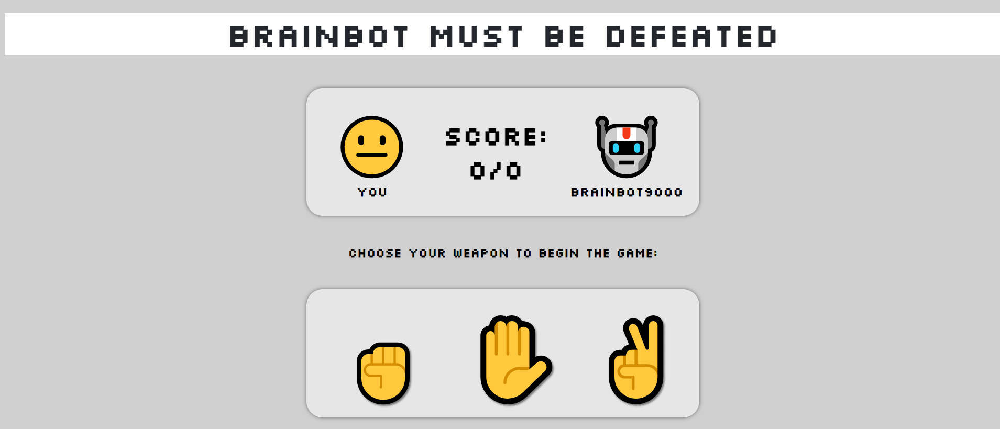

# Brainbot Must Be Defeated

[](https://github.com/dannykryan/RockPaperScissors)

Try Online: [Brainbot Must Be Defeated](https://github.com/dannykryan/RockPaperScissors)

This game was originally created for the 'Rock, Paper, Scissors' project, which was one of the first projects set in The Odin Project's full-stack JavaScript course.

I enjoyed the project so much that I developed it further so that the player must battle the evil 'Brainbot 9000' to save the earth from destruction!

It uses lots of emojis as illustrations and a system that prompts the user depending on their choices and progress - with some fun and sometimes snarky comments depending on how the player is doing!

---

## Installation

To work with this app, follow these steps:

1. Start a new project in your IDE.
2. Clone down the repo:

```
git clone https://github.com/dannykryan/RockPaperScissors.git
```

3. You can now view the website running locally in your browser by right-clicking index.html and choosing 'Open in Live Server'.
